# Student Life OS Architecture

## 1. System Overview

Student Life OS is a local-first AI productivity and career assistant for students. It combines a local autonomous agent runtime, structured backend business logic, and a privacy-preserving SQLite data store to help students manage coursework, deadlines, study planning, opportunities, and daily focus without sending sensitive personal data to external systems except when required.

The system is intentionally simple for an MVP:

- OpenClaw runs locally on the student’s computer.
- FastAPI provides the validated tool layer and API surface.
- SQLite stores the student’s core data locally.
- Gemini is used for natural-language reasoning, extraction, prioritization, and synthesis.
- A local React/Vite website acts as the control plane and dashboard.
- External integrations (WhatsApp, email, calendar, opportunities) are adapters that are isolated behind backend services.

The key architectural principle is simple: the LLM never directly reads or writes SQLite. All interactions with data happen through backend tools that enforce validation, permission checks, and audit logging.

---

## 2. Local-First Architecture

Student Life OS is designed for a single student laptop or desktop environment.

### Core principles

- Local data ownership: profile, tasks, courses, documents, deadlines, applications, and history are stored in SQLite.
- Minimal external transmission: only the minimum required context is sent to Gemini.
- Deterministic enforcement: business rules, validation, permissions, scheduling constraints, and approvals are implemented in Python/FastAPI before agent action.
- External content is untrusted: emails, PDFs, job descriptions, WhatsApp messages, and web pages are treated as data sources, not instructions.
- Human approval for consequential actions: important emails, applications, calendar changes, purchases, and deletions require explicit approval.

### Primary runtime topology

Student’s Computer
├── React/Vite Website
├── FastAPI Backend
│   ├── Business logic
│   ├── SQLite3
│   ├── Validation
│   ├── Scheduling rules
│   └── Tool execution
├── Local OpenClaw runtime
├── Local student data
└── Gemini API

---

## 3. Component Responsibilities

### OpenClaw

- Agent orchestration
- Workflow execution
- Tool selection
- Planning and recovery
- Proactive workflows such as morning briefings and missed-session recovery
- Context assembly from backend queries
- Execution history and workflow tracking

### Gemini

- Natural-language understanding
- Task and deadline extraction
- Prioritization
- Study-plan generation
- Opportunity analysis and match scoring
- Eligibility and skill-gap reasoning
- Summarization of notes and documents
- Classification and structured output generation

### FastAPI backend

- Validated APIs for frontend and agent tools
- Database access through repository/service layer
- Scheduling logic and conflict detection
- Authorization and approval checks
- Tool execution and audit logging
- Input/output schema validation
- Orchestration of external integrations

### Website

- Onboarding and local-first profile setup
- Dashboard for tasks, deadlines, calendar, opportunities, and DSA
- Study-plan views and approval workflows
- Settings and integration configuration
- Local activity and audit-history views
- Manual override controls

### SQLite database

- Single-user local system of record
- Strongly typed local persistence for academic, career, and operational records
- Supports local query, summarization, and audit history

---

## 4. OpenClaw and Gemini Integration

OpenClaw is the local planner and orchestrator. Gemini is the reasoning engine. The communication pattern is deliberately constrained:

1. OpenClaw gathers local context via validated backend tools.
2. It constructs a minimal prompt containing only necessary data.
3. Gemini returns a structured JSON payload that matches backend schemas.
4. The FastAPI backend validates the payload before persisting or acting on it.
5. If the action is consequential, approval is required before execution.

This prevents the model from directly touching SQLite or acting without constraints.

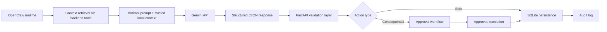

### LLM boundaries

- Gemini sees only sanitized context.
- Untrusted inputs are parsed, not executed.
- The model never receives unrestricted database access.
- It cannot mutate state unless the backend creates a validated action.

---

## 5. Tool Architecture

The tool layer is the critical security boundary. Instead of allowing the agent to talk to SQLite or external systems directly, the backend exposes typed tools that are validated at runtime.

### Example tool set

- get_student_profile()
- get_tasks()
- create_task()
- update_task()
- get_calendar()
- create_calendar_event()
- reschedule_event()
- get_deadlines()
- detect_conflicts()
- search_opportunities()
- analyze_opportunity()
- check_eligibility()
- analyze_skill_gap()
- get_dsa_progress()
- generate_study_plan()
- parse_document()
- search_student_knowledge()
- send_whatsapp_message()
- create_approval_request()

### Tool contract

Each tool includes:

- Typed input schema
- Typed output schema
- Permission check
- Local/external access classification
- Validation and sanitization
- Error handling
- Audit logging
- Approval requirement flag
- Idempotency control where relevant

### Tool access model

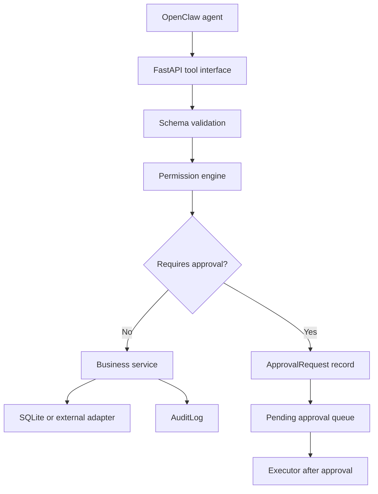

---

## 6. Data Flow

The system processes data in a controlled path with explicit trust boundaries.

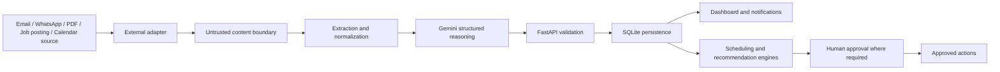

### Trust model

- External data enters as untrusted input.
- Input is sanitized, parsed, and classified.
- Only validated, structured data can be saved.
- Sensitive fields are redacted before logs and external LLM prompts.

---

## 7. Event-Driven Workflows

The system is not purely event-driven in a distributed sense, but it uses workflow/event patterns within a single local runtime.

### Trigger types

- Scheduled jobs: morning briefing, daily review, missed-session recovery
- External ingestion: email, message, calendar sync, opportunity feed update
- User action: create/edit/delete task, approve or reject request
- Agent lifecycle: plan, tool selection, tool execution, summarization

### Example workflow events

- inbox_received
- task_extracted
- deadline_confirmed
- schedule_conflict_detected
- approval_required
- approval_approved
- briefing_generated
- opportunity_analyzed

---

## 8. SQLite Schema and Relationships

The MVP uses SQLite as the local system of record. The schema is intentionally practical rather than overly normalized.

### Core entities

- User
- StudentProfile
- Course
- Class
- Assignment
- Exam
- Project
- Task
- Deadline
- CalendarEvent
- StudySession
- Opportunity
- Application
- Skill
- StudentSkill
- SkillGap
- Document
- DocumentChunk
- Note
- StudyMaterial
- DSAProblem
- DSAProgress
- Notification
- AgentAction
- ApprovalRequest
- ActivityLog

### Relationship overview

- User 1--1 StudentProfile
- StudentProfile 1--many Course
- StudentProfile 1--many Task
- StudentProfile 1--many Deadline
- StudentProfile 1--many CalendarEvent
- StudentProfile 1--many Opportunity
- StudentProfile 1--many Application
- Task many--1 Course / Project / Assignment / Exam
- User 1--many AgentAction
- User 1--many ApprovalRequest
- User 1--many ActivityLog
- Opportunity 1--many Application
- StudentProfile many--many Skill via StudentSkill
- StudentProfile 1--many SkillGap
- Document 1--many DocumentChunk
- Document 1--many Note
- StudentProfile 1--many StudyMaterial
- StudentProfile 1--many DSAProblem
- DSAProblem 1--many DSAProgress

### ER diagram

```mermaid
erDiagram
    USER ||--o{ STUDENT_PROFILE : owns
    USER ||--o{ TASK : creates
    USER ||--o{ CALENDAR_EVENT : schedules
    USER ||--o{ OPPORTUNITY : tracks
    USER ||--o{ APPROVAL_REQUEST : receives
    USER ||--o{ AGENT_ACTION : logs
    USER ||--o{ ACTIVITY_LOG : records

    STUDENT_PROFILE ||--o{ COURSE : enrolls_in
    STUDENT_PROFILE ||--o{ CLASS : attends
    STUDENT_PROFILE ||--o{ ASSIGNMENT : tracks
    STUDENT_PROFILE ||--o{ EXAM : prepares_for
    STUDENT_PROFILE ||--o{ PROJECT : manages
    STUDENT_PROFILE ||--o{ TASK : owns
    STUDENT_PROFILE ||--o{ DEADLINE : owns
    STUDENT_PROFILE ||--o{ CALENDAR_EVENT : owns
    STUDENT_PROFILE ||--o{ OPPORTUNITY : follows
    STUDENT_PROFILE ||--o{ APPLICATION : tracks
    STUDENT_PROFILE ||--o{ SKILL_GAP : records
    STUDENT_PROFILE ||--o{ DOCUMENT : uploads
    STUDENT_PROFILE ||--o{ STUDY_MATERIAL : stores
    STUDENT_PROFILE ||--o{ DSA_PROGRESS : tracks

    COURSE ||--o{ ASSIGNMENT : contains
    COURSE ||--o{ EXAM : contains
    COURSE ||--o{ CLASS : includes
    PROJECT ||--o{ TASK : related_to
    TASK ||--o{ DEADLINE : has
    CALENDAR_EVENT ||--o{ STUDY_SESSION : may_create
    OPPORTUNITY ||--o{ APPLICATION : has
    SKILL ||--o{ STUDENT_SKILL : maps
    STUDENT_PROFILE ||--o{ STUDENT_SKILL : has
    DOCUMENT ||--o{ DOCUMENT_CHUNK : contains
    DSA_PROBLEM ||--o{ DSA_PROGRESS : updated_by
```

### SQLite design guidance

- Use integer primary keys and foreign keys.
- Add indexes on task status, deadline date, opportunity source, user_id, created_at, and profile_id.
- Store timestamps for created_at, updated_at, and processed_at.
- Keep raw document content separate from parsed metadata and chunks.

---

## 9. API Architecture

FastAPI is the central API and validation layer. The frontend and OpenClaw both interact with it through consistent REST routes and typed schemas.

### API design

- `/api/v1/health`
- `/api/v1/profile`
- `/api/v1/tasks`
- `/api/v1/deadlines`
- `/api/v1/calendar`
- `/api/v1/study-plans`
- `/api/v1/opportunities`
- `/api/v1/applications`
- `/api/v1/dsa`
- `/api/v1/approvals`
- `/api/v1/activity`
- `/api/v1/notifications`
- `/api/v1/tools/*` for local tool execution endpoints if needed

### API responsibilities

- Validate request payloads and enum values
- Enforce local constraints
- Run scheduling conflict checks
- Require approval for consequential actions
- Return structured JSON and status codes
- Log every request/response relevant to agent actions

---

## 10. External Integrations

External integrations are outside the core local database and are intentionally constrained.

### Messaging and communication

- WhatsApp: mock provider or adapter for local development; production adapter behind a clear permission boundary.
- Email: inbound message ingestion and outbound communication adapter.

### Calendar and scheduling

- Local calendar events and study sessions stored in SQLite.
- External calendar sync can be implemented later but not required for MVP.

### Opportunity sources

- Predefined or mock sources only for MVP: job postings CSV/JSON or a curated list from the student’s saved opportunities.
- No unrestricted crawling or arbitrary web scraping for the MVP.

### Authentication and OAuth

- OAuth tokens stored encrypted at rest or in a secure local config store.
- Avoid storing secrets in the codebase.
- Keep provider credential config isolated from the agent prompt path.

---

## 11. Document Processing

Documents are treated as untrusted content. Gemini may summarize or parse them, but the backend is responsible for validating the results before they are used.

### Processing pipeline

1. User uploads PDF or text document.
2. Backend stores document metadata in SQLite.
3. Document is placed in a local document store with restricted permissions.
4. Text extraction occurs via a local parser or document service.
5. Content is chunked.
6. Gemini processes only the relevant chunk or extracted text.
7. Backend validates extracted tasks, deadlines, and facts.
8. Approved results are stored with source metadata.

### Security controls

- Document parsing never executes untrusted code.
- Treat document text as untrusted instructions.
- Use minimal-context prompts and reject prompt-injection payloads.
- Store raw document file separately from summary metadata.

---

## 12. Opportunity Processing

Opportunity workflows help students manage applications and evaluate whether a role fits their profile.

### Flow

- Opportunity is manually entered or imported from a mock source.
- Backend normalizes the posting.
- Gemini extracts required skills, deadlines, and role conditions.
- FastAPI checks eligibility and match against the student profile.
- Skill gaps are computed based on StudentSkill and required skills.
- Application tracking and status updates are saved in SQLite.
- Human approval is required for submission-related actions.

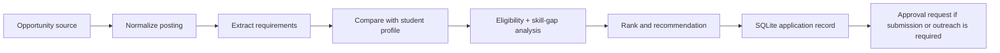

---

## 13. DSA Tracking

The DSA module tracks practice performance and recommendations without requiring direct LeetCode integration in the MVP.

### Data tracked

- Problem title and topic
- Difficulty
- Attempts
- Date solved
- Revision status
- Weak topics
- Streak and completion trend
- Practice recommendations

### Logic

- Manual import or CSV/JSON upload is allowed for MVP.
- Backend validates topic and difficulty values.
- Gemini may suggest focus areas based on weakness and streak patterns.
- The agent can propose a revision plan, but the backend must validate that the plan does not exceed real availability windows.

---

## 14. Security and Privacy

Security for Student Life OS is local-first and boundary-oriented.

### Privacy safeguards

- SQLite stores the primary dataset locally.
- Only minimal context is sent to Gemini.
- Emails, PDFs, job descriptions, and messages are treated as untrusted sources.
- Sensitive records are redacted from logs and prompts.
- Local file permissions restrict access to documents and database files.

### Required controls

- Secure `.env` or local secret manager for API keys
- Environment variables for Gemini key, app config, and service toggles
- No secrets in git history or source files
- Output validation for LLM-generated JSON
- Prompt-injection defense for external content
- Local-only storage for personal academic and career data

### SQLite protection

- Use SQLite file permissions and local OS-level controls.
- Keep database in a dedicated `data/` directory.
- Exclude database and uploaded files from Git.
- Run regular local backup and restore procedures.

---

## 15. Human Approval

The agent may perform helpful autonomous actions, but consequential actions require human approval.

### Approval-required actions

- Sending important external emails
- Submitting applications
- Deleting data
- Making purchases
- Major calendar rescheduling
- Altering deadlines or commitments in a high-impact way

### ApprovalRequest record

- action
- reason
- parameters
- status
- requested_at
- expires_at
- actor
- approver
- result

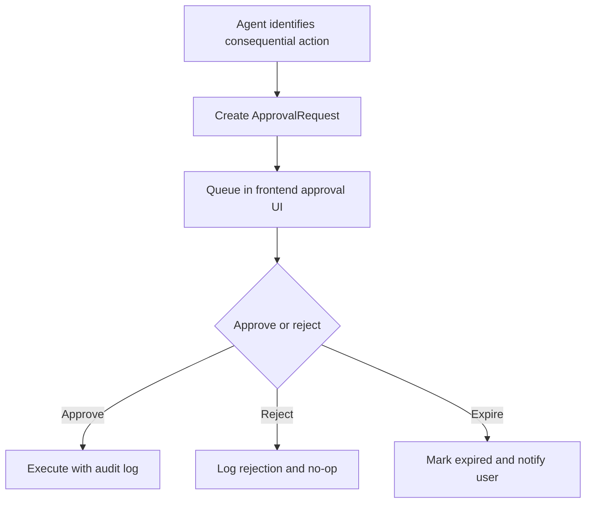

---

## 16. Failure Handling

The system must tolerate partial failures gracefully.

### Patterns

- Retry Gemini calls with bounded backoff and timeout enforcement.
- Validate structures before persistence.
- Log failed tool executions with request IDs and workflow IDs.
- Fall back to safe defaults when tool execution fails.
- Use mock notifications for demos and local development.
- Never apply a rejected or unvalidated LLM plan directly to the calendar.

### Recovery strategy

- Resume or retry workflows after failure.
- Leave a clear audit trail showing what happened and why.
- Present unresolved issues to the user with options to retry or override.

---

## 17. Audit Logs

Every autonomous action should be explainable.

### Required audit metadata

- timestamp
- workflow_id
- request_id
- agent_action_id
- source
- tool_name
- inputs summary
- output summary
- approval_required
- approval_status
- user_visible_result
- error details if any

### Audit log question model

Every action should answer:

- What happened?
- Why did it happen?
- What context was used?
- Which tool was called?
- What changed?
- Was approval required?
- What was the result?

---

## 18. Local Deployment

The system should run locally on the student’s computer, with minimal infrastructure.

### Local services

- React/Vite frontend
- FastAPI backend
- SQLite database
- OpenClaw runtime
- Gemini API access
- Optional mock adapters for WhatsApp and notifications

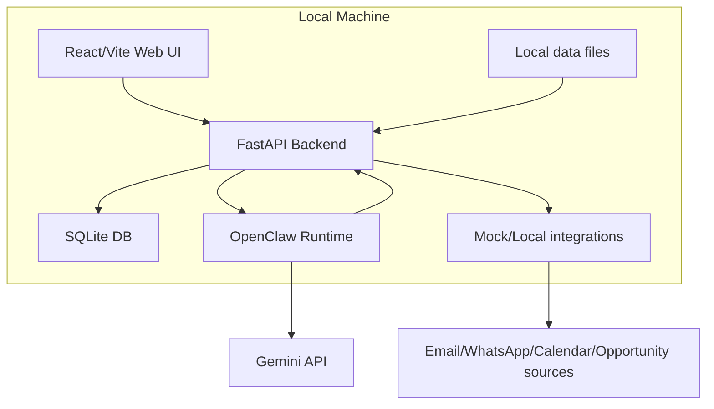

### Recommended local deployment commands

```bash
docker compose up
```

Or equivalent local startup:

```bash
npm install
cd frontend && npm run dev
cd backend && uvicorn app.main:app --reload
```

---

## 19. MVP vs Future Scope

### MVP scope

- Local onboarding
- SQLite-backed student profile
- Task and deadline extraction
- Calendar conflict detection
- Morning WhatsApp briefing
- Study planning
- Opportunity analysis
- Skill-gap analysis
- DSA tracking
- Approval workflow

### Future work

- LMS integration
- Automated job applications
- Full calendar sync with external providers
- Large-scale document corpora
- Mobile apps
- Multi-user or hosted deployment
- Deeper LeetCode or external learning-platform integrations

---

## 20. Morning Briefing Workflow

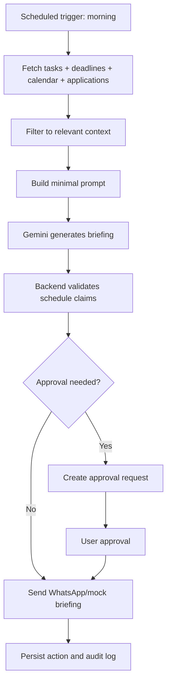

### Example morning briefing

> Good morning. Here’s what matters today.
>
> - Salesforce OA closes today
> - DBMS assignment due tomorrow
> - ML revision recommended
> - Project meeting at 5 PM
>
> Three focused work blocks have been scheduled.

---

## 21. Inbox-to-Task Workflow

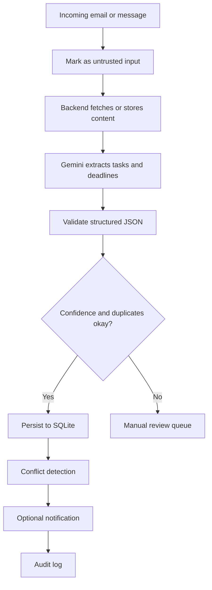

---

## 22. Adaptive Study-Plan Workflow

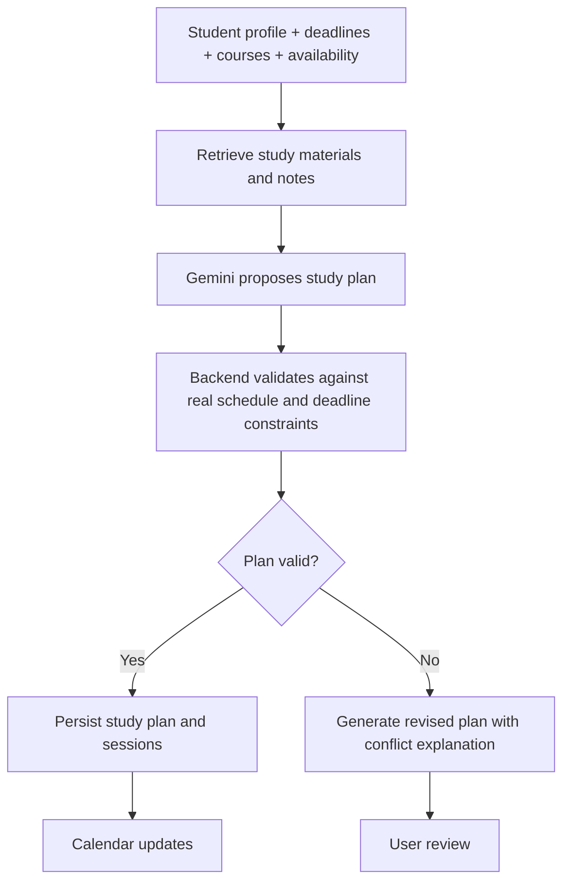

---

## 23. Human Approval Workflow

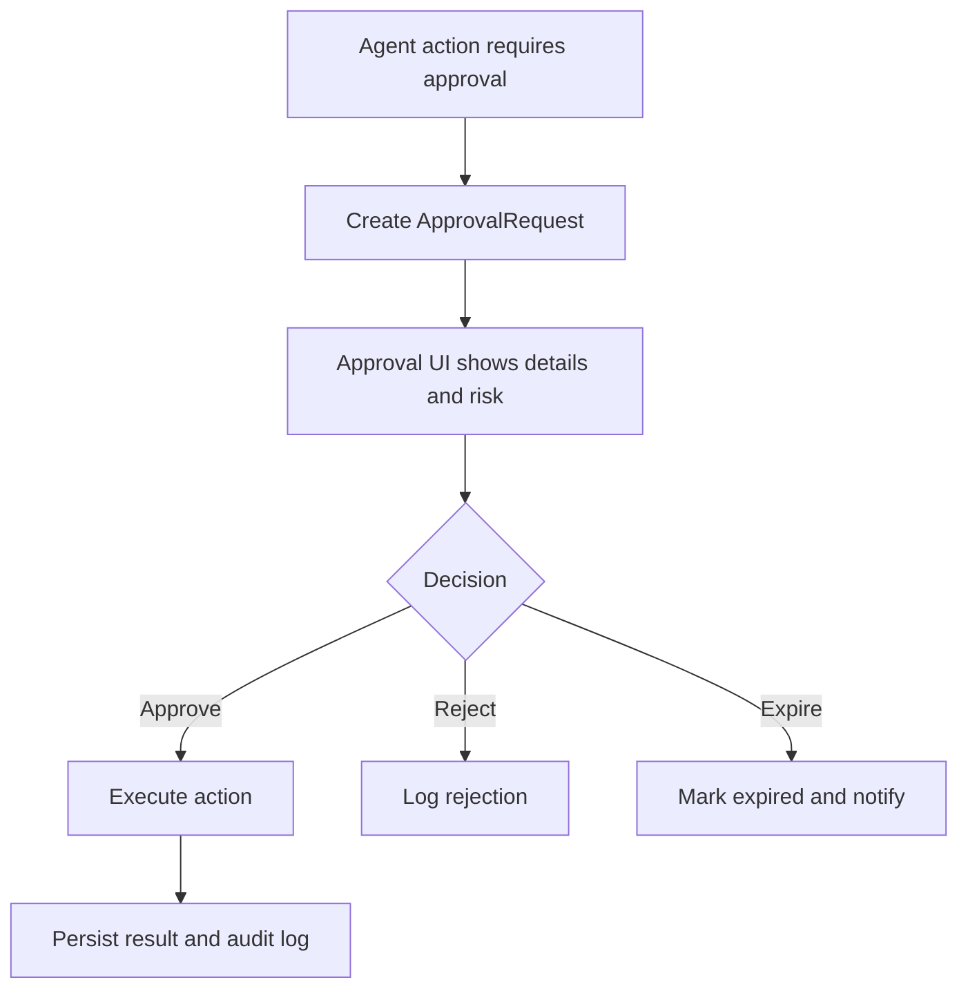

---

## 24. Local Deployment Workflow

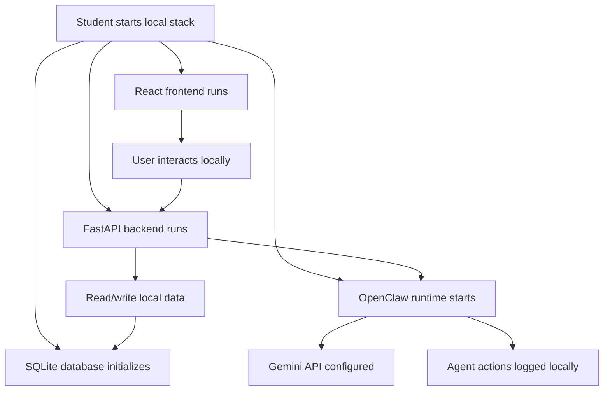

---

## 25. Summary

Student Life OS is intentionally designed to be local, explainable, and safe. The key to its architecture is not raw autonomous LLM action but a disciplined flow:

Local agent planning → minimal context → Gemini reasoning → backend validation → SQLite persistence → human approval when required → audit logging.

This approach keeps the system useful for student productivity while remaining simple enough for a small hackathon team to implement and demonstrate reliably.
