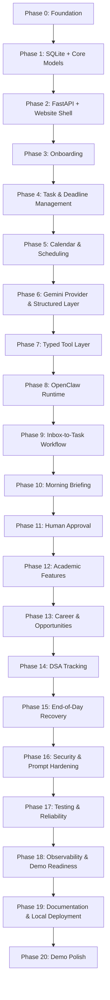

# Student Life OS Implementation Plan

## 1. Purpose and Execution Model

This implementation plan is designed for a small hackathon team building Student Life OS in a dependency-aware order. The goal is to produce a working vertical slice of a local-first productivity and career assistant without overbuilding infrastructure.

The project should be implemented in a deliberate sequence:

1. foundation and local stack
2. domain model and SQLite
3. backend and website shell
4. deterministic student data flows
5. scheduling and validation
6. Gemini abstraction
7. backend tool layer
8. local OpenClaw runtime
9. first end-to-end workflow
10. expand into academic, career, DSA, and approval features
11. harden privacy, security, and testing
12. polish the demo and documentation

This order matters because deterministic data, validation, and scheduling logic must exist before relying on Gemini to propose actions. Otherwise the agent may create invalid or unsafe state changes.

---

## 2. Team Split for a Small Hackathon Team

### Recommended team roles

- Backend and database lead
  - FastAPI app structure
  - SQLite models and repositories
  - validation and scheduling logic
  - API endpoints and service layer

- Frontend lead
  - Vite/React shell
  - onboarding forms
  - task/deadline dashboard
  - approval screens
  - settings and navigation

- Agent/OpenClaw/Gemini lead
  - OpenClaw configuration
  - prompt design and structured JSON schemas
  - prompting strategies and tool selection
  - workflow registration

- Integrations and testing lead
  - mock adapters for email/Telegram/calendar
  - security and prompt-injection checks
  - tests and local workflow validation
  - documentation and demo preparation

A team of 3–4 people can work effectively if the backend and agent contracts are defined early and the frontend consumes a stable API shape.

---

## 3. Dependency Graph

---

## 4. Feature-to-Phase Mapping

| Feature | Phase |
| --- | --- |
| Repo, environment, startup stack | 0 |
| SQLite schema and repositories | 1 |
| API shell and frontend shell | 2 |
| Student onboarding | 3 |
| Task and deadline management | 4 |
| Scheduling and conflict detection | 5 |
| Gemini structured provider | 6 |
| Typed tool layer | 7 |
| OpenClaw runtime setup | 8 |
| Inbox-to-task automation | 9 |
| Morning briefing | 10 |
| Human approval flow | 11 |
| Academic planning | 12 |
| Opportunity analysis | 13 |
| DSA tracking | 14 |
| End-of-day recovery | 15 |
| Security hardening | 16 |
| Automated testing | 17 |
| Observability and demo visibility | 18 |
| Documentation and deployment | 19 |
| Final hackathon polish | 20 |

---

## 5. Prioritized Backlog

### Must have

- local onboarding and profile
- task creation and extraction
- deadline tracking
- calendar conflict detection
- local SQLite persistence
- morning briefing
- approval flow
- opportunity scoring and skill-gap analysis
- DSA progress tracking
- local demo UX

### Should have

- document parsing and chunking
- study-plan generation
- notifications and mock Telegram adapter
- audit history and workflow logs
- custom filters and sorting
- missed-session recovery

### Could have

- email integration
- richer opportunity sources
- semantic search over notes
- revision-material generation
- advanced calendar heuristics

### Future

- multi-user hosted deployment
- full OAuth integrations
- LMS connectors
- direct LeetCode integration
- automated application submission
- mobile app and sync

---

## 6. Phase-by-Phase Delivery Plan

## Phase 0: Project Foundation

### Objective
Set up the local development foundation so the team can build and run the stack consistently.

### Why it comes first
The rest of the project depends on having a reliable local environment, common config, and consistent startup scripts.

### Features to implement
- repository structure
- frontend with React/Vite
- backend with FastAPI
- Python environment
- Node environment
- local Python and npm startup
- `.env.example`
- `.gitignore`
- configuration management
- logging
- health-check endpoints
- local data directories

### Files or modules to create/update
- `frontend/package.json`
- `backend/requirements.txt`
- `backend/app/main.py`
- `backend/app/core/config.py`
- `backend/app/core/logging.py`
- `start.py`
- `.env.example`
- `.gitignore`

### API endpoints
- `GET /api/v1/health`
- `GET /api/v1/ready`

### Database changes
- none yet; create `data/sqlite/` directory

### Frontend changes
- Vite app bootstrapped
- basic layout shell and base styles

### OpenClaw changes
- placeholder config file for local runtime startup

### Gemini changes
- stub provider configuration

### Tests
- health-check API test
- environment config smoke test

### Definition of done
The team can install dependencies, launch the frontend and backend, and confirm the stack is healthy in local development.

### Dependencies
- None

### Risks
- inconsistent local setup across team members
- missing environment variables

### Fallback or mock implementation
- use mock values in `.env.example` and local dev defaults

---

## Phase 1: SQLite Database and Core Models

### Objective
Create the local database and the minimum viable set of core entities needed for the application.

### Why it comes before backend logic
The backend and workflows need a known schema before endpoints or tools can be implemented.

### Features to implement
- SQLite connection management
- migration strategy
- SQLAlchemy or equivalent ORM setup
- base models and metadata
- primary keys and foreign keys
- indexes
- seed data
- repositories/data-access layer
- validation helpers

### Minimum core entities
- User
- StudentProfile
- Task
- Deadline
- CalendarEvent
- AgentAction
- ApprovalRequest
- ActivityLog

### Additional entities for later phases
- Course, Class, Assignment, Exam, Project
- StudySession, Opportunity, Application
- Skill, StudentSkill, SkillGap
- Document, DocumentChunk, Note, StudyMaterial
- DSAProblem, DSAProgress
- Notification

### Files or modules to create/update
- `backend/app/db/database.py`
- `backend/app/models/*.py`
- `backend/app/repositories/*.py`
- `backend/app/services/validation.py`
- `tests/db/test_models.py`

### API endpoints
- none yet; database layer only

### Database changes
- create schema with foreign keys and indexes
- seed baseline user and profile records

### Frontend changes
- none yet

### OpenClaw changes
- none yet

### Gemini changes
- none yet

### Tests
- schema creation test
- repository CRUD smoke tests
- fixture creation

### Definition of done
Database migrations or creation scripts work locally and core models can be created, read, updated, and deleted without breaking foreign keys.

### Dependencies
- Phase 0

### Risks
- schema grows unbounded with early over-modeling
- missing indexes causing poor performance

### Fallback or mock implementation
- use simple SQLite file and explicit schema scripts instead of heavy migration tooling for MVP

---

## Phase 2: FastAPI Core and Local Website Shell

### Objective
Implement the backend application foundation and a basic website shell to expose the domain.

### Why it comes now
The frontend and backend need a stable API contract before onboarding and workflows are implemented.

### Features to implement
- FastAPI application structure
- API versioning
- CORS for local development
- error handling
- request validation
- response schemas
- basic local authentication or single-user mode
- React app shell
- navigation and layout
- dashboard placeholder
- settings page
- API client utilities

### Files or modules to create/update
- `backend/app/api/v1/*.py`
- `backend/app/schemas/*.py`
- `backend/app/core/exceptions.py`
- `backend/app/main.py`
- `frontend/src/App.tsx`
- `frontend/src/pages/*.tsx`
- `frontend/src/api/client.ts`

### API endpoints
- `GET /api/v1/health`
- `GET /api/v1/profile`
- `GET /api/v1/tasks`
- `GET /api/v1/deadlines`
- `GET /api/v1/calendar`
- `GET /api/v1/activity`
- `GET /api/v1/approvals`

### Database changes
- no new entities beyond setup tables

### Frontend changes
- app shell and navigation
- placeholder dashboard and settings pages

### OpenClaw changes
- local runtime stub registration

### Gemini changes
- provider is still stubbed

### Tests
- endpoint smoke tests
- schema validation tests
- frontend build check

### Definition of done
The backend runs locally and serves a basic dashboard shell. The frontend can call a health endpoint and display a placeholder state.

### Dependencies
- Phase 1

### Risks
- poor API design that becomes harder to change later
- mismatched frontend/backend schemas

### Fallback or mock implementation
- use simple mock responses for unimplemented dashboard data during shell development

---

## Phase 3: Student Onboarding and Profile

### Objective
Implement the profile model and onboarding forms so the system has real local context for planning.

### Why it comes before automation
Gemini-based recommendations and scheduling must know the student’s profile, goals, and constraints.

### Features to implement
- student profile onboarding form
- name, timezone, college, degree, year, CGPA
- courses and class records
- target roles and companies
- skills and preferred locations
- available study hours
- preferred study times
- notification preferences
- validation and empty states

### Files or modules to create/update
- `frontend/src/pages/Onboarding.tsx`
- `backend/app/api/v1/profile.py`
- `backend/app/services/profile_service.py`
- `backend/app/models/profile.py`

### API endpoints
- `POST /api/v1/profile`
- `GET /api/v1/profile/{id}`
- `PUT /api/v1/profile/{id}`

### Database changes
- StudentProfile entity
- Course/Class records
- StudentSkill relationships

### Frontend changes
- onboarding wizard or multi-step form
- edit flow and read-only profile summary

### OpenClaw changes
- no major changes

### Gemini changes
- no major changes

### Tests
- profile validation tests
- onboarding form test smoke

### Definition of done
A student can configure a profile and persist it locally. The profile is available to later task, calendar, and opportunity functionality.

### Dependencies
- Phase 2

### Risks
- too much form complexity too early
- incomplete data shapes causing inconsistent downstream logic

### Fallback or mock implementation
- use local form validation and default values for optional fields

---

## Phase 4: Deterministic Task and Deadline Management

### Objective
Before adding LLM automation, implement the deterministic task and deadline model.

### Why it comes before Gemini extraction
The backend logic must be reliable and validated before agent-driven extraction is allowed to write tasks.

### Features to implement
- manual task creation
- task editing and completion
- task deletion safeguards
- priority, category, effort estimation, source
- related entities
- confirmed vs inferred deadlines
- overdue detection
- filtering and sorting
- duplicate detection

### Deterministic backend logic
- deadline normalization
- overdue detection
- priority validation
- required fields
- task status transitions
- duplicate detection

### Files or modules to create/update
- `backend/app/models/task.py`
- `backend/app/models/deadline.py`
- `backend/app/services/task_service.py`
- `backend/app/api/v1/tasks.py`
- `frontend/src/pages/TasksPage.tsx`

### API endpoints
- `GET /api/v1/tasks`
- `POST /api/v1/tasks`
- `PUT /api/v1/tasks/{id}`
- `DELETE /api/v1/tasks/{id}`
- `GET /api/v1/deadlines`

### Database changes
- Task and Deadline schemas
- indexes on status, due_date, source, user_id

### Frontend changes
- task list, create/edit modal, filters, completion toggles

### OpenClaw changes
- nothing yet beyond future tool registration

### Gemini changes
- none yet until structured extraction is added later

### Tests
- duplicate detection test
- overdue logic test
- required-field validation test

### Definition of done
Tasks can be created, updated, completed, and deleted with safe validations. Deadline logic is predictable and testable.

### Dependencies
- Phases 1–3

### Risks
- over-scope status models
- backend validation drift from agent assumptions

### Fallback or mock implementation
- use deterministic status enums and minimal duplicate logic for MVP

---

## Phase 5: Calendar and Scheduling Engine

### Objective
Implement deterministic scheduling before Gemini is allowed to propose plans.

### Why it comes before the agent can propose schedules
The LLM should not decide schedule validity without a backend rule layer enforcing availability and deadlines.

### Features to implement
- calendar events
- study sessions
- availability windows
- event duration
- conflict detection
- deadline constraints
- missed-session detection
- rescheduling validation

### Scheduling service features
- find available time blocks
- detect overlaps
- detect insufficient preparation time
- reject invalid schedules
- return explainable conflict results

### Files or modules to create/update
- `backend/app/models/calendar_event.py`
- `backend/app/models/study_session.py`
- `backend/app/services/scheduling_service.py`
- `backend/app/api/v1/calendar.py`
- `frontend/src/pages/CalendarPage.tsx`

### API endpoints
- `GET /api/v1/calendar`
- `POST /api/v1/calendar/events`
- `PUT /api/v1/calendar/events/{id}`
- `POST /api/v1/calendar/availability`
- `POST /api/v1/calendar/reschedule`

### Database changes
- CalendarEvent and StudySession entities
- conflict and availability indexes

### Frontend changes
- monthly or weekly calendar view
- conflict warnings
- study session creation

### OpenClaw changes
- tools for retrieving calendar and detecting conflicts

### Gemini changes
- no direct plan writes yet

### Tests
- overlap detection test
- deadline conflict detection test
- reschedule rejection test

### Definition of done
The backend can generate valid study blocks and reject schedules that violate student availability or preparation time.

### Dependencies
- Phases 1, 2, 4

### Risks
- ambiguous availability rules
- poor UX around conflict explanations

### Fallback or mock implementation
- use simple work-block windows and conflict detection instead of a complex scheduler

---

## Phase 6: Gemini Provider and Structured LLM Layer

### Objective
Set up Gemini as a structured provider returning validated JSON instead of freeform text.

### Why it comes before automation
Gemini should only be used after the backend has a stable schema to validate against.

### Features to implement
- secure API-key loading
- configurable model name
- timeouts
- retry handling
- rate-limit handling
- structured JSON responses
- schema validation
- token/context limits
- minimal-context construction
- redaction of nonessential sensitive data
- logging without exposing sensitive content

### Reusable services
- task extraction
- deadline extraction
- classification
- prioritization
- study-plan generation
- opportunity analysis
- eligibility reasoning
- skill-gap reasoning
- summarization
- revision-material generation

### Files or modules to create/update
- `backend/app/services/gemini_service.py`
- `backend/app/services/prompt_builder.py`
- `backend/app/services/schema_validation.py`
- `backend/app/integrations/gemini_client.py`

### API endpoints
- internal service endpoints may not be exposed directly; use backend service layer

### Database changes
- minimal metadata for Gemini call logs can be stored in AgentAction or ActivityLog

### Frontend changes
- none directly

### OpenClaw changes
- provider configuration and minimal context builder

### Gemini changes
- primary implementation begins here

### Tests
- mock Gemini JSON response test
- retry and rate-limit handling
- prompt redaction test
- invalid-schema rejection test

### Definition of done
Gemini can be called securely with minimal context and its responses are validated before any state changes.

### Dependencies
- Phases 1–5

### Risks
- model outputs being inconsistent or malformed
- accidental leakage of protected context

### Fallback or mock implementation
- mock Gemini adapter for tests and local demos

---

## Phase 7: Typed Tool Layer

### Objective
Create backend tools that OpenClaw can call in a safe, typed, and auditable way.

### Why it comes before local agent execution
The agent must never write to SQLite directly; it should call backend tools that enforce permissions and validation.

### Features to implement
- typed input/output schemas
- permission checks
- local vs external classification
- validation
- error handling
- audit logging
- approval requirement flags
- idempotency where needed

### Minimum tools
- get_student_profile()
- get_tasks()
- create_task()
- update_task()
- get_calendar()
- create_calendar_event()
- reschedule_event()
- get_deadlines()
- detect_conflicts()
- search_opportunities()
- analyze_opportunity()
- check_eligibility()
- analyze_skill_gap()
- get_dsa_progress()
- generate_study_plan()
- parse_document()
- search_student_knowledge()
- send_telegram_message()
- create_approval_request()

### Files or modules to create/update
- `backend/app/tools/*.py`
- `backend/app/schemas/tools/*.py`
- `backend/app/services/permission_service.py`
- `backend/app/services/audit_service.py`

### API endpoints
- `POST /api/v1/tools/run`
- `GET /api/v1/tools/schema`

### Database changes
- AgentAction and ActivityLog are used to track tool execution

### Frontend changes
- minimal debug panel for tool execution results

### OpenClaw changes
- tool registration and invocation against backend endpoints

### Gemini changes
- none direct; it only returns structured reasoning outputs

### Tests
- tool schema validation tests
- permission enforcement tests
- idempotency tests
- audit logging tests

### Definition of done
OpenClaw can call safe backend tools, and every tool interaction produces an auditable record.

### Dependencies
- Phase 6

### Risks
- tool interfaces become too broad and unsafe
- permission model turns too complex for MVP

### Fallback or mock implementation
- convert all tool validation to strict Python dataclasses and Pydantic schemas

---

## Phase 8: OpenClaw Local Runtime Integration

### Objective
Wire OpenClaw into the local stack and configure the first student agent.

### Why it comes before autonomous workflows
OpenClaw should be integrable only once the backend contract and tools are stable.

### Features to implement
- agent configuration
- Gemini provider configuration
- tool registration
- workflow registration
- local context retrieval
- agent execution logging
- workflow IDs and request IDs
- failure recovery
- safe tool invocation

### Files or modules to create/update
- `openclaw/agent/student_life_agent.py`
- `openclaw/workflows/*.py`
- `openclaw/tools/registry.py`
- `openclaw/config.py`

### API endpoints
- internal orchestration only; no new external endpoints required

### Database changes
- store workflow and action records in `AgentAction` and `ActivityLog`

### Frontend changes
- activity feed to visualize agent operations

### OpenClaw changes
- runtime and workflow registration

### Gemini changes
- now integrated into live agent prompts

### Tests
- end-to-end tool invocation test
- workflow execution test with mock data
- failure-recovery test

### Definition of done
A local agent can read data through backend tools, reason through Gemini, and execute structured actions safely.

### Dependencies
- Phases 6 and 7

### Risks
- agent is too autonomous too soon
- tool mismatch between backend and OpenClaw implementation

### Fallback or mock implementation
- use a single main agent with a limited number of workflows rather than multiple independent agents

---

## Phase 9: Inbox-to-Task Workflow

### Objective
Implement the first end-to-end autonomous workflow that turns incoming untrusted content into validated tasks.

### Why it comes now
This is the highest-value demonstration of the full pipeline and establishes the pattern for all later workflows.

### Features to implement
- incoming email/message/document handling
- untrusted-content marking
- extraction of tasks and deadlines
- duplicate and confidence checks
- backend validation
- persistence to SQLite
- conflict detection
- notification
- audit logging

### Files or modules to create/update
- `backend/app/workflows/inbox_to_task.py`
- `backend/app/integrations/email_adapter.py`
- `backend/app/integrations/message_adapter.py`
- `openclaw/workflows/inbox_to_task.py`

### API endpoints
- `POST /api/v1/inbox/process`
- `GET /api/v1/tasks?source=inbox`

### Database changes
- Task and ActivityLog updates
- source tracking and confidence score fields if added

### Frontend changes
- inbox feed and extracted task preview

### OpenClaw changes
- workflow definition, trigger logic, and tool orchestration

### Gemini changes
- task/deadline extraction prompt and schema

### Tests
- realistic email test
- realistic PDF/document test
- duplicate prevention test
- injection-resistance test

### Definition of done
An untrusted email or document can be converted into a validated task and deadline in SQLite with audit logs.

### Dependencies
- Phases 6–8

### Risks
- false positive task extraction
- prompt injection causing unsafe extraction

### Fallback or mock implementation
- use a mock inbox provider and mock documents for local demo

---

## Phase 10: Morning Briefing Workflow

### Objective
Implement the scheduled daily briefing that surfaces priorities without exposing unnecessary context.

### Why it comes after inbox automation
It builds on the same extraction and validation model while adding calendar, deadlines, and opportunity summaries.

### Features to implement
- retrieve local tasks, deadlines, calendar events, applications, opportunities, and study sessions
- minimal-context prompt to Gemini
- briefing generation and validation
- Telegram or mock notification
- audit log

### Files or modules to create/update
- `backend/app/workflows/morning_briefing.py`
- `backend/app/services/briefing_service.py`
- `backend/app/integrations/telegram_adapter.py`
- `frontend/src/pages/BriefingPage.tsx`

### API endpoints
- `POST /api/v1/workflows/morning-briefing`
- `GET /api/v1/notifications`

### Database changes
- Notification and ActivityLog entries

### Frontend changes
- briefing preview and notification history

### OpenClaw changes
- scheduled trigger and rendering

### Gemini changes
- briefing prompt and extraction schema

### Tests
- briefing generation with mock data
- schedule validation test
- permission test for outbound notifications

### Definition of done
A morning briefing can be generated locally, reviewed, and sent via mock or external notification channel with audit logging.

### Dependencies
- Phases 4, 5, 6, 7, 8, 9

### Risks
- too much context sent to Gemini
- schedule claims not grounded in real availability

### Fallback or mock implementation
- use mock Telegram provider for demo and local dev

---

## Phase 11: Human Approval Workflow

### Objective
Implement approval gating for consequential actions.

### Why it comes before additional autonomous behaviors
Once the agent can propose changes, it must ask permission before affecting the user’s real commitments or sending external communication.

### Features to implement
- approval request creation
- approval queue
- approve/reject/expire/retry flows
- result logging

### Required approval scenarios
- significant calendar changes
- important external emails
- application submissions
- deletions
- purchases

### Files or modules to create/update
- `backend/app/models/approval_request.py`
- `backend/app/api/v1/approvals.py`
- `frontend/src/pages/ApprovalsPage.tsx`
- `backend/app/services/approval_service.py`

### API endpoints
- `GET /api/v1/approvals`
- `POST /api/v1/approvals`
- `PUT /api/v1/approvals/{id}/approve`
- `PUT /api/v1/approvals/{id}/reject`
- `PUT /api/v1/approvals/{id}/expire`

### Database changes
- ApprovalRequest schema and indexes

### Frontend changes
- approval queue UI and risk details

### OpenClaw changes
- create approval requests before critical actions

### Gemini changes
- none direct; the model proposes actions but does not execute them

### Tests
- approval creation test
- approve/reject flow test
- expiry test
- action blocking by approval test

### Definition of done
Any consequential action is blocked until explicit approval is granted.

### Dependencies
- Phase 7

### Risks
- users ignore approval queues
- workflow stalls if approvals are not handled quickly

### Fallback or mock implementation
- show approval requests in a local queue UI with manual override

---

## Phase 12: Academic Features

### Objective
Extend the system to manage academic work and study planning based on actual deadlines and course information.

### Why it comes after approval and scheduling logic
Academic features rely on the foundation introduced in task, deadline, and calendar phases.

### Features to implement in order
1. exam and assignment tracking
2. manual study-plan creation
3. Gemini-assisted study-plan generation
4. syllabus document upload
5. topic extraction
6. study-plan persistence
7. calendar scheduling
8. missed-session recovery
9. weakness tracking
10. notes-to-revision-material generation
11. semester knowledge search

### Files or modules to create/update
- `backend/app/models/assignment.py`
- `backend/app/models/exam.py`
- `backend/app/models/study_material.py`
- `backend/app/services/study_plan_service.py`
- `frontend/src/pages/AcademicPage.tsx`

### API endpoints
- `GET /api/v1/academic/assignments`
- `GET /api/v1/academic/exams`
- `POST /api/v1/study-plans`
- `GET /api/v1/study-plans`
- `POST /api/v1/study-plans/generate`

### Database changes
- Assignment, Exam, Project, StudySession, StudyMaterial, Note records

### Frontend changes
- academic dashboard
- assignment list
- study-plan views
- syllabus upload UI

### OpenClaw changes
- course planning workflow

### Gemini changes
- plan generation and revision-material prompts

### Tests
- study-plan validation test
- missed-session recovery test
- topic extraction test

### Definition of done
A student can maintain academic work, generate a study plan that respects deadlines and availability, and adjust it after missed sessions.

### Dependencies
- Phases 4, 5, 6, 7, 8, 11

### Risks
- plans generated without real availability
- inconsistent course metadata

### Fallback or mock implementation
- manual study-plan creation before Gemini-assisted generation

---

## Phase 13: Career and Opportunity Features

### Objective
Add structured opportunity analysis and match scoring for internships and jobs.

### Why it comes after the student profile exists
Career features depend on profile data, skills, availability, and target roles.

### Features to implement in order
1. opportunity data model
2. manual opportunity entry
3. opportunity source adapter interface
4. normalization
5. requirement extraction
6. eligibility checking
7. match scoring
8. skill-gap analysis
9. application tracking
10. opportunity ranking
11. Telegram opportunity updates

### Files or modules to create/update
- `backend/app/models/opportunity.py`
- `backend/app/models/application.py`
- `backend/app/services/opportunity_service.py`
- `backend/app/integrations/opportunity_adapter.py`
- `frontend/src/pages/OpportunitiesPage.tsx`

### API endpoints
- `GET /api/v1/opportunities`
- `POST /api/v1/opportunities`
- `GET /api/v1/opportunities/{id}/match`
- `POST /api/v1/applications`

### Database changes
- Opportunity and Application tables; skill-gap references

### Frontend changes
- opportunity list, match score, skill-gap indicators, application tracker

### OpenClaw changes
- opportunity analysis workflow

### Gemini changes
- requirement extraction, match and skill-gap reasoning

### Tests
- opportunity scoring test
- eligibility test
- skill-gap calculation test

### Definition of done
The system can normalize and rank opportunities, identify fit gaps, and create application records without unrestricted crawling.

### Dependencies
- Phases 3, 6, 7, 8, 11

### Risks
- overreliance on scraping or untrusted data
- poor scoring logic

### Fallback or mock implementation
- curated or imported opportunities only; no unrestricted crawling in MVP

---

## Phase 14: DSA Tracking

### Objective
Track competitive programming progress and provide revision recommendations.

### Why it comes after the core scheduling and profile models exist
DSA needs real student profile and constraint data to generate useful recommendations.

### Features to implement
- manual problem entry
- CSV/JSON import
- difficulty, topic, attempts, dates
- revision status
- weak-topic analysis
- streak calculation
- practice recommendations

### Files or modules to create/update
- `backend/app/models/dsa_problem.py`
- `backend/app/models/dsa_progress.py`
- `backend/app/services/dsa_service.py`
- `frontend/src/pages/DSAPage.tsx`

### API endpoints
- `GET /api/v1/dsa`
- `POST /api/v1/dsa/problems`
- `POST /api/v1/dsa/import`
- `GET /api/v1/dsa/recommendations`

### Database changes
- DSAProblem and DSAProgress records

### Frontend changes
- DSA dashboard and streak tracking

### OpenClaw changes
- dsa recommendation workflow

### Gemini changes
- weak-topic analysis and recommendation prompt

### Tests
- topic aggregation tests
- streak calculation tests
- import validation tests

### Definition of done
The student can track solved problems, weak topics, and trending practice recommendations from a local system of record.

### Dependencies
- Phase 3, 5, 6, 7, 8

### Risks
- incomplete problem metadata
- poor import UX

### Fallback or mock implementation
- manual entry and CSV import for local demo

---

## Phase 15: End-of-Day Recovery and Focus Sessions

### Objective
Support daily recovery after missed sessions or schedule drift.

### Why it comes after calendars and scheduling logic
It depends on real scheduling rules and approval constraints.

### Features to implement
- focus session start/end records
- planned vs actual duration
- task association
- missed-session detection
- end-of-day review
- automatic rescheduling proposal
- approval for significant schedule changes
- Telegram or mock notification

### Files or modules to create/update
- `backend/app/services/focus_service.py`
- `backend/app/workflows/end_of_day_review.py`
- `frontend/src/pages/FocusPage.tsx`

### API endpoints
- `POST /api/v1/focus/sessions`
- `PUT /api/v1/focus/sessions/{id}/end`
- `POST /api/v1/focus/recovery`

### Database changes
- focus session records
- potentially activity notes in ActivityLog

### Frontend changes
- focus timer and daily review summary

### OpenClaw changes
- missed-session recovery workflow

### Gemini changes
- recovery recommendation prompt

### Tests
- missed session detection test
- rescheduling approval gate test

### Definition of done
The system can detect a missed or incomplete schedule, propose a recovery plan, and require approval for major rescheduling actions.

### Dependencies
- Phases 5, 7, 8, 10, 11

### Risks
- incomplete focus session data
- over-aggressive rescheduling

### Fallback or mock implementation
- use summary-only recommendations and mock notifications during demos

---

## Phase 16: Security, Privacy, and Prompt-Injection Hardening

### Objective
Harden the local-first system against privacy leaks and prompt-injection vulnerabilities.

### Why it comes late
The system has to be built and tested with real workflows before hardening is meaningful. Security is easier to enforce once the architecture is stable.

### Features to implement
- secure environment variables
- API-key protection
- local database file permissions
- uploaded-document isolation
- input validation
- output validation
- prompt-injection defenses
- untrusted-content boundaries
- minimal Gemini context
- sensitive-data redaction
- approval enforcement
- audit-log privacy
- external integration credential protection

### Files or modules to create/update
- `backend/app/core/security.py`
- `backend/app/services/redaction_service.py`
- `backend/app/services/prompt_injection_guard.py`
- `tests/security/test_prompt_injection.py`

### API endpoints
- no new endpoints required

### Database changes
- possible logging redaction and metadata-only persistence

### Frontend changes
- show security status and local-only data notices if needed

### OpenClaw changes
- secure context assembly and tool-access policy checks

### Gemini changes
- limited context construction; no direct database access

### Tests
- malicious email payload test
- malicious PDF/notes test
- malicious job description test
- outbound message guard test

### Definition of done
The system rejects or sanitizes malicious content and only exposes minimal, necessary data to external reasoning.

### Dependencies
- Phase 9 onward

### Risks
- too much sensitive context included in logs
- over-sanitization reduces model usefulness

### Fallback or mock implementation
- use rule-based rejection for suspicious user-provided text and wrap LLM prompts with strict sanitization

---

## Phase 17: Testing and Reliability

### Objective
Build a comprehensive test suite to validate the core system behavior.

### Why it comes before final demo polish
The project will be much more reliable if the agent, database, API, and scheduling logic are tested systematically.

### Features to implement
- unit tests
- API tests
- database tests
- tool tests
- scheduling tests
- Gemini mock tests
- OpenClaw workflow tests
- integration tests
- end-to-end demo tests
- failure and retry tests
- approval-flow tests
- prompt-injection tests

### Files or modules to create/update
- `tests/api/*.py`
- `tests/db/*.py`
- `tests/tools/*.py`
- `tests/workflows/*.py`
- `tests/integration/*.py`

### API endpoints
- all validated across integration tests

### Database changes
- test fixtures and seeded data

### Frontend changes
- none beyond tests of components if needed

### OpenClaw changes
- workflow test harness for mocked tool calls

### Gemini changes
- mocked provider with structured response fixtures

### Tests
- full suite; no untested agent workflow

### Definition of done
The team can run a local test suite that verifies task creation, deadlines, approvals, scheduling, and workflow execution.

### Dependencies
- Phases 9–16

### Risks
- time spent on broad tests instead of feature delivery
- brittle tests from overmocking

### Fallback or mock implementation
- use test adapters for Gemini and external integrations without losing core behavior coverage

---

## Phase 18: Observability and Demo Readiness

### Objective
Make agent activity transparent and easy to explain during demonstration.

### Why it matters for the demo
The app should be understandable to users and judges, especially when showing autonomous actions.

### Features to implement
- structured logs
- workflow IDs
- request IDs
- agent execution history
- tool-call history
- Gemini-call metadata
- error tracking
- approval history
- notification history
- local activity dashboard

### Files or modules to create/update
- `backend/app/services/observability_service.py`
- `frontend/src/pages/ActivityPage.tsx`
- `backend/app/core/logging.py`

### API endpoints
- `GET /api/v1/activity`
- `GET /api/v1/notifications`

### Database changes
- ActivityLog and Notification updates

### Frontend changes
- activity timeline and trace viewer

### OpenClaw changes
- attach workflow IDs and request IDs to all actions

### Gemini changes
- record model metadata without leaking sensitive data

### Tests
- trace logging tests
- user-visible action explanation tests

### Definition of done
Every autonomous action can be explained in plain language, including what happened, why, which tools were used, and what approvals were required.

### Dependencies
- Phases 9–17

### Risks
- too much logging becomes noisy or privacy-unsafe

### Fallback or mock implementation
- store coarse summary metadata and redact raw payloads

---

## Phase 19: Documentation and Local Deployment

### Objective
Complete the project documentation and local deployment setup for reuse outside the hackathon environment.

### Why it comes near the end
The project should be documented after the architecture and feature set are stable.

### Features to implement
- `ARCHITECTURE.md`
- `README.md`
- `IMPLEMENTATION_PLAN.md`
- `.env.example`
- local startup launcher
- Local setup instructions
- Integration setup instructions
- Database backup instructions
- Data reset instructions
- Troubleshooting guide
- Security notes
- Demo instructions

### Files or modules to create/update
- root-level markdown docs
- `start.py`
- `.env.example`
- `.gitignore`

### API endpoints
- documentation only

### Database changes
- backup process and local reset scripts

### Frontend changes
- none required beyond final UX polish

### OpenClaw changes
- startup instructions and data directions

### Gemini changes
- .env keys and model config documentation

### Tests
- deployment smoke test
- local stack startup check

### Definition of done
A new developer can clone the repo and launch the full stack locally without additional design decisions.

### Dependencies
- All previous phases

### Risks
- docs become stale immediately after final changes
- missing local deployment instructions for Windows/macOS/Linux differences

### Fallback or mock implementation
- default local dev instructions that work on the same machine used for demo

---

## Phase 20: Hackathon Demo Polish

### Objective
Prepare a compelling 3–5 minute demonstration of the system working as a coherent local-first AI assistant.

### Why it comes last
By this point the system should be stable enough to present confidently in a demo environment.

### Features to implement
- local onboarding
- email-driven task extraction
- deadline detection
- calendar conflict detection
- revised schedule proposal
- human approval
- SQLite persistence
- morning briefing
- opportunity analysis
- skill-gap analysis
- DSA dashboard

### Files or modules to create/update
- all final UX and demo flow polishing
- mock external adapters
- final data fixtures for demo flow

### API endpoints
- demo-specific endpoints or stable API paths only

### Database changes
- pre-seeded demo data for a realistic student profile

### Frontend changes
- dashboard polish, onboarding flow, approval UI, demo narrative state

### OpenClaw changes
- simplified demo workflow and predictable responses

### Gemini changes
- prompt/test fixture tuned for task extraction and summarization

### Tests
- end-to-end demo script test
- failure fallback test

### Definition of done
The demo story is reliable, concise, and demonstrates the architectural principles clearly: local agent → Gemini reasoning → validated tools → SQLite persistence → approval → local notification.

### Dependencies
- all prior phases

### Risks
- system gets too complex or brittle before demo
- external integrations are flaky

### Fallback or mock implementation
- clearly label mock adapters and use local fixtures to maintain reliability

---

## 8. Final Pre-Demo Checklist

### Functional readiness
- [ ] student can onboard locally
- [ ] task extraction works from email or mock content
- [ ] deadline extraction works and is validated
- [ ] scheduler detects conflicts and proposes valid alternatives
- [ ] approval flow blocks high-risk actions
- [ ] SQLite persists core student data locally
- [ ] morning briefing sends a concise summary
- [ ] opportunity analysis shows fit and skill gaps
- [ ] DSA dashboard records progress
- [ ] activity log explains agent decisions

### Security readiness
- [ ] no secrets committed to repo
- [ ] API keys loaded from local environment only
- [ ] malicious input is rejected or sanitized
- [ ] raw data and prompts are minimally logged
- [ ] external content is treated as untrusted

### Demo readiness
- [ ] one-click local startup works
- [ ] mock Telegram adapter is clearly labeled
- [ ] a realistic demo profile exists
- [ ] single user flow is stable and repeatable
- [ ] all key actions are visible in the UI and activity log

---

