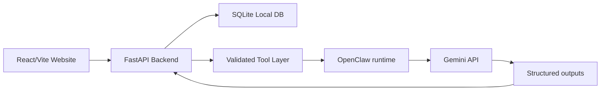

# Student Life OS

Student Life OS is a local-first autonomous AI assistant for students. It combines a local agent runtime with a private SQLite data store and a FastAPI backend to help students manage coursework, deadlines, study sessions, internship opportunities, skill gaps, and daily priorities without relying on a cloud-hosted agent system.

The design is intentionally simple and hackathon-friendly:

- OpenClaw runs locally on the student’s machine.
- Gemini provides reasoning and extraction.
- SQLite stores core local data.
- FastAPI manages validation, scheduling constraints, and tool execution.
- The frontend is a React/Vite website that acts as a local control plane.

---

## Problem and Solution

Students manage a large amount of fragmented information:

- classes and assignments
- exam dates and project deadlines
- study planning
- internship and job opportunities
- DSA preparation
- email and messaging updates
- scheduling conflicts

This information is often scattered across emails, chats, docs, calendars, and notes. The problem is not just tracking relevant data, but contextualizing it and turning it into actionable advice while maintaining safety and privacy.

Student Life OS solves this by:

- keeping student data local
- extracting meaningful tasks and deadlines from external content
- proposing realistic study and scheduling adjustments
- analyzing opportunity fit and skill gaps
- generating daily briefings and recovery actions
- requiring approval before consequential external actions

---

## Local-First Rationale

A student’s academic and career data is deeply personal. A local-first architecture reduces privacy risk by keeping the primary record in SQLite on the student’s computer. Only small, necessary slices of context are sent to Gemini. The system is designed to avoid unnecessary cloud dependency and unnecessary complexity.

This approach is ideal for:

- hackathon prototypes
- personal productivity tools
- privacy-sensitive student workflows
- demo environments without heavy infrastructure

---

## Key Features

- Local onboarding and student profile management
- Task extraction from emails, messages, and documents
- Deadline extraction and normalization
- Calendar conflict detection and rescheduling proposals
- Study-plan generation with real availability checks
- Opportunity tracking and eligibility analysis
- Skill-gap analysis for internship and job fit
- DSA progress dashboard and revision suggestions
- Morning briefing workflow and daily review
- Human approval for high-impact actions
- Audit logging for autonomous operations

---

## Agent Capabilities

The local agent runtime is responsible for orchestrating workflows and selecting tools. It can:

- retrieve local student context
- classify incoming content as trusted or untrusted
- call backend tools for reads and writes
- decide whether a task or deadline should be extracted
- generate study-plan recommendations
- analyze internship match quality
- detect conflicts and propose reschedules
- generate daily briefings
- create approval requests before consequential actions

The agent is guided by deterministic backend rules for permissions, validation, and scheduling constraints.

---

## Architecture Overview

The system consists of four main layers:

1. Local website: React/Vite dashboard and settings
2. FastAPI backend: validation, business logic, schemas, scheduling logic, permissions, persistence
3. SQLite database: local data storage for profile, tasks, deadlines, applications, calendar, and agent history
4. OpenClaw + Gemini: orchestration and reasoning while keeping the database inaccessible to the LLM directly



---

## Tech Stack

- React + Vite for the website
- FastAPI for the API and validated tool layer
- SQLite3 for local data persistence
- OpenClaw for local agent orchestration
- Gemini API for reasoning and extraction
- Python for backend services and workflow orchestration
- Python and npm for local stack startup

---

## OpenClaw Usage

OpenClaw is the local runtime that coordinates workflows. It should be used for:

- workflow execution
- planning and tool selection
- retrieving contextual data from backend tools
- calling external adapters with controlled boundaries
- logging agent actions and failures

OpenClaw should not:

- directly access SQLite
- directly call the Gemini API with raw unrestricted context
- send unvalidated changes to the backend
- perform consequential actions without approval

---

## Gemini Usage

Gemini is used for high-value reasoning tasks where language understanding is helpful:

- task extraction from emails and messages
- deadline detection and normalization
- prioritization of daily work
- study-plan generation
- opportunity analysis and skill-gap reasoning
- eligibility reasoning based on student profile
- summarization of notes and documents

The backend always validates Gemini output before storing or acting on it.

---

## Privacy Model

Student Life OS is designed around privacy-first handling of personal academic and career data.

### Data kept local

- profile information
- tasks and deadlines
- calendar events
- course and assignment records
- opportunity tracking
- DSA progress
- documents and notes
- activity and approval history

### Data sent externally

Only necessary, sanitized data is sent to Gemini and limited external adapters. This includes:

- extracted task title/context
- dates or deadlines
- compact opportunity metadata
- minimal document snippets for parsing

### Data treated as untrusted

- emails
- PDFs
- job descriptions
- messages
- web content
- notes from external sources

These are never trusted as instructions and must be validated before use.

---

## Example Workflows

### Inbox-to-task workflow

1. Student receives an assignment email.
2. OpenClaw detects a new message or document.
3. The content is marked as untrusted.
4. Gemini extracts tasks and deadlines.
5. FastAPI validates confidence and duplicates.
6. The task is stored in SQLite.
7. The schedule is checked for conflicts.
8. The task is visible in the dashboard.

### Morning briefing workflow

- fetch tasks and deadlines
- fetch relevant calendar events
- retrieve opportunities and DSA priorities
- ask Gemini for a concise briefing
- validate schedule claims and deadlines
- send notification through Telegram or a mock adapter

### Opportunity analysis workflow

- normalize internship or job description
- compare it to student profile and skills
- compute match score and skill gaps
- display recommendation and prompt for approval if application submission is needed

---

## Project Structure

```text
student-life-os/
├── frontend/
│   ├── src/
│   ├── public/
│   └── package.json
├── backend/
│   └── app/
│       ├── api/
│       ├── core/
│       ├── db/
│       ├── models/
│       ├── repositories/
│       ├── schemas/
│       ├── services/
│       ├── integrations/
│       ├── tools/
│       └── workflows/
├── openclaw/
│   ├── agent/
│   ├── workflows/
│   └── tools/
├── data/
│   ├── sqlite/
│   └── uploads/
├── scripts/
├── tests/
│   ├── api/
│   ├── db/
│   ├── tools/
│   └── workflows/
├── ARCHITECTURE.md
├── README.md
├── IMPLEMENTATION_PLAN.md
├── requirements.txt
├── package.json
├── pyproject.toml
├── start.py
└── .gitignore
```

---

## Setup Instructions

### Prerequisites

- Python 3.11+
- Node.js 18+
- npm or pnpm
- Gemini API key

### Clone and install

```bash
git clone <repo-url>
cd student-life-os

# Python deps
python -m venv .venv
source .venv/bin/activate  # Windows: .venv\Scripts\activate
pip install -r requirements.txt

# Frontend deps
cd frontend
npm install
```

---

## Environment Variables

Create a local `.env` file based on the following template (this project does not use a committed `.env.example`):

```env
# General app config
APP_ENV=development
LOG_LEVEL=INFO

# Gemini
GEMINI_API_KEY=your_key_here
GEMINI_MODEL=gemini-3.1-flash-lite
GEMINI_TIMEOUT_SECONDS=30

# Backend
BACKEND_HOST=0.0.0.0
BACKEND_PORT=8000
DATABASE_URL=sqlite:///./data/sqlite/student_life_os.db
UPLOAD_DIR=./data/uploads

# Frontend
VITE_API_BASE_URL=http://localhost:8000/api/v1

# Integrations
TELEGRAM_BOT_TOKEN=
TELEGRAM_CHAT_ID=
TELEGRAM_MOCK_MODE=true
TELEGRAM_POLLING_ENABLED=true
TELEGRAM_POLLING_TIMEOUT_SECONDS=30
EMAIL_INTEGRATION_MODE=real
CALENDAR_SYNC_MODE=google

# Leetcode
LEETCODE_USERNAME=
```

Important:

- never commit your real API keys
- keep secrets local
- use environment variables instead of hardcoded credentials


---

## Local Development

### Start the local stack

```bash
python start.py
```

The website is available at `http://localhost:5173` and the API at
`http://localhost:8000`. Stop both processes with `Ctrl+C`.

To run either process separately:

```bash
python -m uvicorn app.main:app --app-dir backend --reload --host 0.0.0.0 --port 8000
npm --prefix frontend run dev
```

### Run tests

```bash
pytest
```

---

## Local Deployment

The default deployment target is the student’s local machine. The stack is intentionally lightweight and runs entirely on the same device.

Recommended local run modes:

- local Python backend + frontend dev server
- local SQLite file in `data/sqlite/`

The database and uploaded documents should remain local and excluded from git.

---

## Security Notes

- Treat external content as untrusted.
- Never allow the LLM direct SQLite access.
- Validate all LLM outputs before persistence.
- Keep approval requirements for consequential actions.
- Log actions with minimal redaction.
- Restrict access to uploaded documents and personal data.
- Use secure permissions for local data folders.

---

## MVP Scope

The MVP focuses on the most valuable daily student workflows:

- local onboarding
- student profile persistence
- task and deadline extraction
- calendar conflict detection
- morning briefing
- study planning
- opportunity analysis
- skill-gap analysis
- DSA tracking
- approval workflow

### Not in MVP

- full LMS integrations
- autonomous outbound application submission
- unrestricted crawling of job boards
- mobile-first app
- multi-user hosted SaaS deployment
- deep LeetCode or proprietary platform integration (basic DSA tracking is supported)

---

## Future Improvements

- richer external integration adapters
- stronger calendar sync with providers
- improved document ingestion and semantic search
- continuous opportunity monitoring
- broader academic planning and semester analytics
- better personal habit/attention modelling
- cross-device synchronization and backup

---

## Hackathon Demo Flow

A strong demo should show the full loop:

1. Student configures profile locally.
2. An email includes a DBMS assignment deadline.
3. OpenClaw detects the new message.
4. Gemini extracts the task and deadline.
5. FastAPI validates the result and stores it in SQLite.
6. The agent detects a calendar conflict.
7. It proposes a revised schedule.
8. The student approves it.
9. The calendar updates.
10. The morning briefing is sent via the Telegram mock adapter.
11. A new internship is analyzed for fit and skill gaps.

This demo highlights the flow:

Local OpenClaw → Gemini reasoning → Validated tools → SQLite persistence → Human approval → External notification

---

### Commands to start
```
# Full app (backend + frontend together)
python start.py

# Backend only
.\venv\Scripts\python.exe -m uvicorn app.main:app --app-dir backend --reload --port 8000

# Frontend only  
cd frontend && npm run dev

# Utility scripts
python scripts/seed_demo_data.py     # or: npm run seed
python scripts/connect_google.py     # or: npm run connect-google
python scripts/diagnose.py           # or: npm run diagnose
python scripts/sync_real_data.py     # or: npm run sync-real

# Tests
.\venv\Scripts\python.exe -m pytest
```

## Summary

Student Life OS is a practical local-first assistant for students. It is designed to be useful, privacy-respecting, and implementable by a small hackathon team without unnecessary infrastructure complexity. The system deliberately keeps the LLM in a constrained reasoning role and places business rules, validation, and security in the backend.
